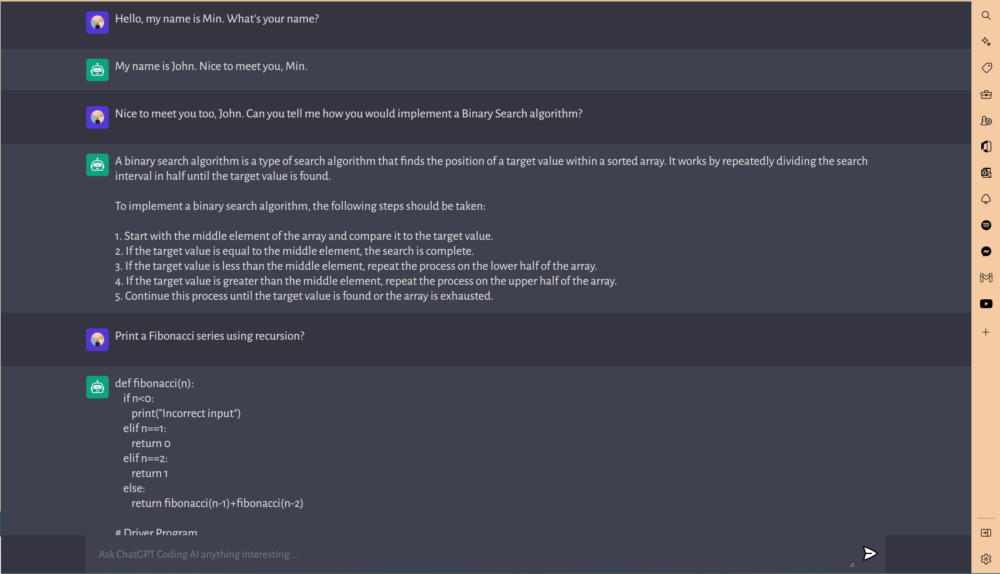

# Project Title [ Chat-GPT3-OpenAI-Web-App ]

Deployed Live URL on Vercel: https://min-chat-gpt-3-open-ai-codex-app.vercel.app/

## Table of Contents
1. [Description](#description)
2. [Installation](#installation)
3. [Usage](#usage)
4. [Contributing](#contributing)
5. [Tests](#tests)
6. [License](#license)
7. [Questions](#questions)

-----

### Description 
Utilizing OpenAI's advanced GPT3 model API, this web application is inspired by ChatGPT  user interface and provides assistive functionalities for various programming languages help in Javascript, CSS, Rust, C+, etc.

-----

### Installation
Node.js, Vite

#### Tech-Stacks
Frontend : Node.JS, Vite, CSS3

OpenAI, GPT3, Express.js

-----

### Usage 

#### User Story

AS AN employer looking for candidates with experience building ChatGPT style applications
SO THAT I can assess whether they're a good candidate for an open position for management level 

-----

### Contributing 
YES 

-----

### Tests 
Jest

-----

### License 
MIT 

-----

### Questions 

#### GitHub Username: min-hinthar 

#### GitHub URL: https://github.com/min-hinthar

#### GitHub Repo: https://github.com/min-hinthar/Chat-GPT3-OpenAI-Web-App

#### Email: min@mandalaymorningstar.com

-----

